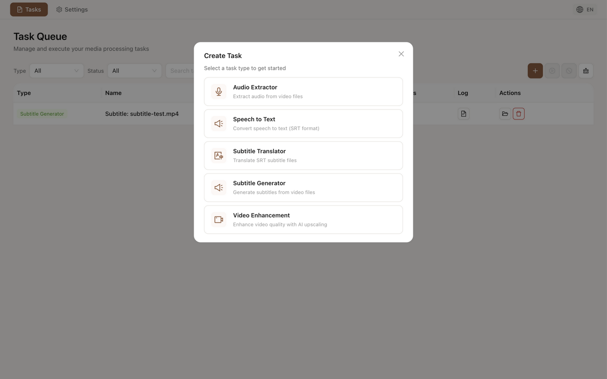
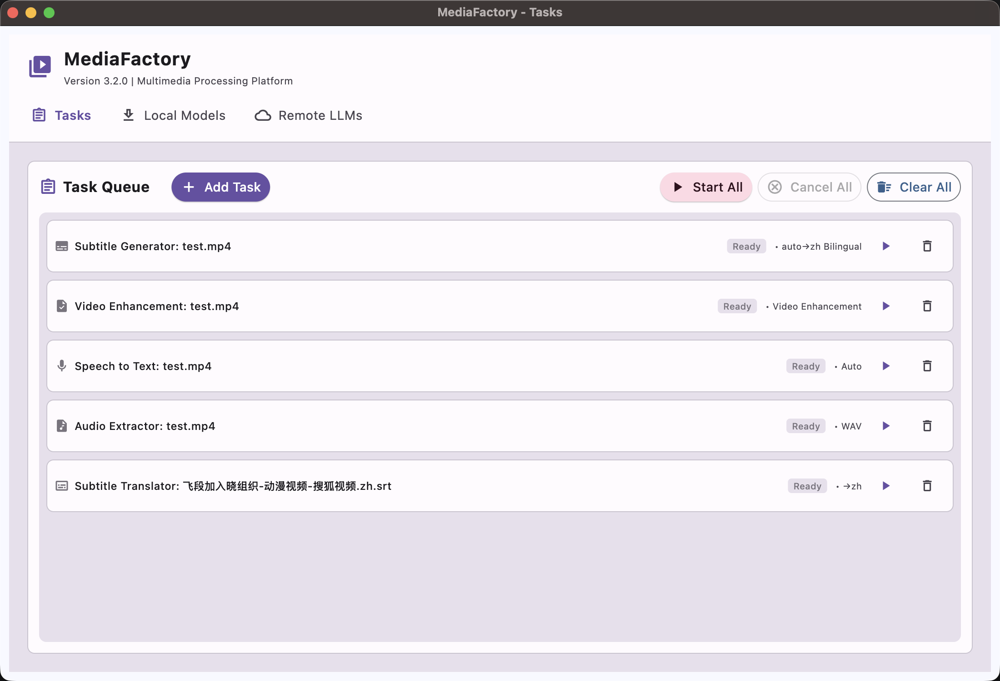
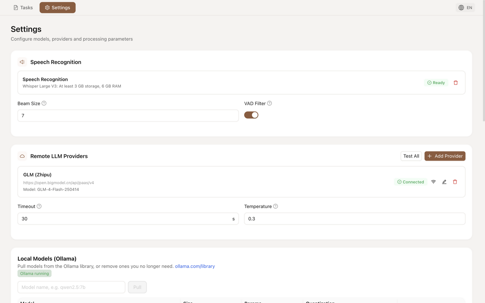

# MediaFactory

<div align="center">
  <h1>🎬 MediaFactory</h1>
  <p><i>Professional Multimedia Processing Platform</i></p>
  <p>
    <a href="#features">Features</a> •
    <a href="#quick-start">Quick Start</a> •
    <a href="#why-mediafactory">Why MediaFactory</a> •
    <a href="#requirements">Requirements</a>
  </p>
</div>

A professional multimedia processing platform for subtitle generation and video-related tasks.

[](https://opensource.org/licenses/MIT)
[](https://www.python.org/downloads/)
[](https://nodejs.org/)

---

## Features

### 🎯 Multiple Task Types

Support for 5 task types: Audio Extraction, Speech-to-Text, Subtitle Generation, Subtitle Translation, and Video Enhancement. Video enhancement includes automatic deinterlace detection, optional CodeFormer face restoration, and optional film grain for old footage. The task queue is a sortable table with type/status filters and name search; every task has a built-in log viewer (live refresh while running, level filtering), and failed tasks can be edited and retried with a new config.

<p align="center">
  
</p>

### 📦 Batch Add Tasks

Drag and drop multiple files or entire folders. Set source/target languages and LLM settings once, then process all files in one go.

<p align="center">
  
</p>

### 🤖 Unified Model Management

Manage all models in one place — the Settings page. Download local Whisper models for fully offline speech recognition, or connect to 7 LLM provider presets (OpenAI, DeepSeek, GLM, Qwen, Moonshot, Ollama, or custom endpoints) for translation. Your choice, your privacy.

<p align="center">
  
</p>

---

## Quick Start

**Prerequisites**: Python 3.11+, [uv](https://docs.astral.sh/uv/), and Node.js ≥20.19.0

```bash
# 1. Clone the repository
git clone https://github.com/DragonL641/MediaFactory.git
cd MediaFactory

# 2. Install dependencies
uv sync --group core          # Python backend deps (includes PyTorch with CUDA 12.8)
npm install                   # Web UI deps

# 3. Run the application
npm run build                          # Build the Web UI (outputs to webui/)
uv run python -m mediafactory          # Start the daemon, then open http://127.0.0.1:8765 in your browser
```

> **Note**: The desktop app (Tauri) is the primary distribution — build it with one command (`uv run python scripts/build/build_darwin.py`, see [BUILD.md](BUILD.md)); a plain browser can also connect to the daemon directly at http://127.0.0.1:8765.
> For frontend development, run `npm run dev` in a second terminal (vite dev server at 5173, proxying `/api` and `/ws` to the daemon).
> PyTorch is downloaded from `download.pytorch.org` (not PyPI) to ensure CUDA support.
> CUDA 12.8 supports Blackwell (RTX 50 series) and earlier architectures.

---

## Why MediaFactory?

AI video tools often force you to choose between quality and speed, or between cloud convenience and privacy. MediaFactory gives you both.

- **Fast and accurate** — Faster Whisper delivers 4-6x speedup without sacrificing quality
- **Smart segmentation** — Intelligent sentence segmentation via stable-ts for natural subtitle boundaries
- **Local or cloud** — Use local models for privacy, or LLM APIs for convenience — your choice
- **Multiple subtitle formats** — SRT, ASS, and WebVTT output support
- **Batch processing done right** — Real progress tracking, not a black box
- **Clean uninstall** — All data stays in one folder, delete it and it's gone

### How we compare

**vs. pyVideoTrans** — Great for TTS dubbing, but GPL-licensed and focused on translation workflows. MediaFactory is MIT-licensed with a cleaner architecture for extensibility.

**vs. VideoCaptioner** — LLM-focused subtitle assistant with GPL license. MediaFactory offers both local and cloud options with a more permissive license.

**vs. SubtitleEdit** — The gold standard for manual subtitle editing with 300+ format support. MediaFactory is for automated generation, not manual editing — use both together.

| Feature | MediaFactory | pyVideoTrans | VideoCaptioner | SubtitleEdit |
|---------|:------------:|:------------:|:--------------:|:------------:|
| **Core Focus** | Auto Generation | Video Translation | LLM Subtitles | Manual Editing |
| **License** | MIT | GPL-3.0 | GPL-3.0 | GPL/LGPL |
| **Speech Recognition** | ✅ Faster Whisper | ✅ Multiple | ✅ Multiple | ✅ Whisper |
| **Local LLM Translation (Ollama)** | ✅ | ✅ | ❌ | ❌ |
| **LLM Translation** | ✅ 7 presets incl. local Ollama | ✅ | ✅ | ✅ Google/DeepL |
| **Batch Processing** | ✅ | ✅ | ✅ | ✅ |
| **Subtitle Editing** | ❌ | ❌ | ❌ | ✅ Full Editor |
| **TTS Dubbing** | ❌ | ✅ | ❌ | ✅ |

---

## Requirements

### Hardware

| Mode | RAM | Storage | Notes |
|------|-----|---------|-------|
| **CPU** | 4GB | 2GB | Works on any platform |
| **GPU** | 8GB | 15GB | NVIDIA GPU with 4GB+ VRAM, Driver ≥ 525.60.13 |

> **macOS users**: Faster Whisper doesn't support Metal (MPS). CPU mode is used automatically.

### Software

- **Python**: 3.11, 3.12, or 3.13 (3.12 recommended)
- **uv**: Modern Python package manager ([install uv](https://docs.astral.sh/uv/))
- **Node.js**: ≥20.19.0 (for Web UI development and build)
- **Rust**: ≥1.77.2 (only needed when building the desktop installer; not required to run from source)
- **FFmpeg**: Included via imageio-ffmpeg (no manual installation needed)
- **macOS**: 12.0 (Monterey) or later

---

## Usage Notes

**Model selection**: Uses `faster-whisper-large-v3` for speech recognition. GPU recommended for best performance.

**Translation**: Requires an LLM provider configured in Settings — cloud LLM APIs (OpenAI, DeepSeek, GLM, etc.) or a local endpoint (Ollama). If some sentences fail to translate, they are kept in the original language and summarized in the logs.

**Local models (Ollama)**: MediaFactory integrates with [Ollama](https://ollama.com) for fully local translation:

1. Install Ollama — it runs as a local service automatically.
2. Open **Settings → Local Models (Ollama)** to pull a model (e.g. `qwen2.5:7b`) or manage installed ones.
3. Use it either as the main translation provider (**Ollama (Local)** in the provider list) or as a per-task **Local Fallback**: when enabled on a translation/subtitle task, sentences the remote LLM fails to translate are retried locally, and the task reports how many sentences were translated remotely, locally, or kept as original.

Memory guidance: 16 GB machines handle common 7B models; 8 GB machines are not recommended for local translation.

**Log files**: All logs are written to `logs/LOG-YYYY-MM-DD-HHMM.log` in the application directory.

---

## What MediaFactory is NOT

- **Not a subtitle editor** — For manual timing adjustments, use [SubtitleEdit](https://github.com/SubtitleEdit/subtitleedit)
- **Not a dubbing tool** — For TTS and voice cloning, use [pyVideoTrans](https://github.com/jianchang512/pyvideotrans)
- **Not an online platform** — Core processing (speech recognition, audio extraction) runs locally. Only translation can optionally use cloud LLM APIs.

---

## License

MIT License
