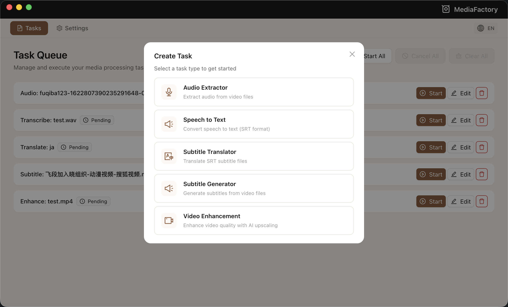
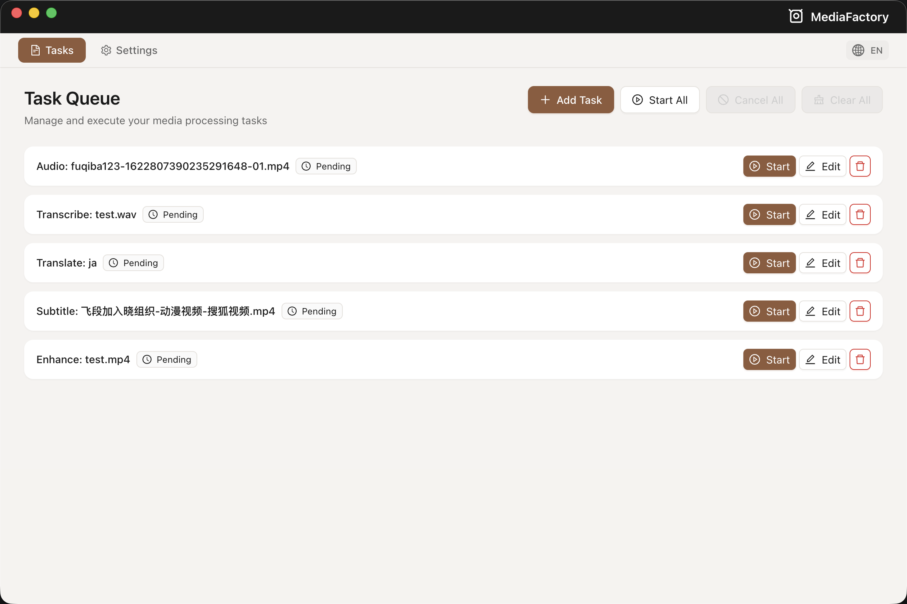
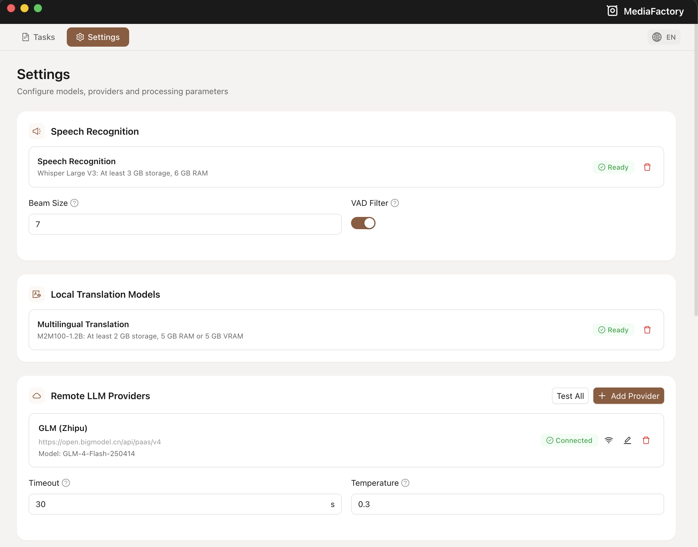

# MediaFactory

<div align="center">
  <h1>🎬 MediaFactory</h1>
  <p><i>专业级多媒体处理平台</i></p>
  <p>
    <a href="#功能特性">功能特性</a> •
    <a href="#快速开始">快速开始</a> •
    <a href="#为什么选择-mediafactory">为什么选择</a> •
    <a href="#系统要求">系统要求</a>
  </p>
</div>

专业级多媒体处理平台，专注于字幕生成和视频相关任务。

[](https://opensource.org/licenses/MIT)
[](https://www.python.org/downloads/)
[](https://nodejs.org/)

---

## 功能特性

### 🎯 多种任务类型

支持 5 种任务类型：音频提取、语音转文字、字幕生成、字幕翻译、视频增强。每个任务卡片显示状态、进度和预计剩余时间。

<p align="center">
  
</p>

### 📦 批量添加任务

拖拽多个文件或整个文件夹。一次性设置源语言/目标语言和 LLM 配置，批量处理所有文件。

<p align="center">
  
</p>

### 🤖 统一模型管理

在设置页面统一管理所有模型 — 下载并配置本地模型（Whisper、M2M100）实现完全离线处理，或接入 6+ 种 LLM 服务（OpenAI、DeepSeek、智谱 GLM、通义千问、Moonshot 或自定义端点）进行云端翻译。你的选择，你的隐私。

<p align="center">
  
</p>

---

## 快速开始

**前置条件**：Python 3.11+ 和 [uv](https://docs.astral.sh/uv/)

```bash
# 1. 克隆仓库
git clone https://github.com/DragonL641/MediaFactory.git
cd MediaFactory

# 2. 安装依赖（包含 CUDA 12.8 版本的 PyTorch）
uv sync --group core

# 3. 下载模型（首次运行前必须）
uv run python scripts/utils/download_model.py facebook/m2m100_1.2B

# 4. 运行应用
uv run mediafactory
```

> **说明**：PyTorch 从 `download.pytorch.org`（而非 PyPI）下载，以确保 CUDA 支持。
> CUDA 12.8 支持 Blackwell（RTX 50 系列）及更早架构。

---

## 为什么选择 MediaFactory？

AI 视频工具往往让你在质量和速度之间、云端便利和隐私之间做选择。MediaFactory 让你两者兼得。

- **快速且准确** — Faster Whisper 提供 4-6 倍加速，不牺牲质量
- **本地或云端** — 本地模型保护隐私，LLM API 提供便利 — 由你选择
- **真正的批量处理** — 真实进度追踪，不是黑盒
- **干净卸载** — 所有数据在一个文件夹，删除即卸载干净

### 竞品对比

**vs. pyVideoTrans** — TTS 配音功能强大，但采用 GPL 许可证，专注于翻译工作流。MediaFactory 采用 MIT 许可证，架构更清晰，更易扩展。

**vs. VideoCaptioner** — 专注于 LLM 的字幕助手，GPL 许可证。MediaFactory 同时提供本地和云端选项，许可证更宽松。

**vs. SubtitleEdit** — 手动字幕编辑的黄金标准，支持 300+ 格式。MediaFactory 专注于自动生成，而非手动编辑 — 两者配合使用效果更佳。

| 功能 | MediaFactory | pyVideoTrans | VideoCaptioner | SubtitleEdit |
|------|:------------:|:------------:|:--------------:|:------------:|
| **核心定位** | 自动生成 | 视频翻译 | LLM 字幕 | 手动编辑 |
| **许可证** | MIT | GPL-3.0 | GPL-3.0 | GPL/LGPL |
| **语音识别** | ✅ Faster Whisper | ✅ 多种 | ✅ 多种 | ✅ Whisper |
| **本地翻译** | ✅ | ✅ | ❌ | ❌ |
| **LLM 翻译** | ✅ 6+ 服务商 | ✅ | ✅ | ✅ Google/DeepL |
| **批量处理** | ✅ | ✅ | ✅ | ✅ |
| **字幕编辑** | ❌ | ❌ | ❌ | ✅ 完整编辑器 |
| **TTS 配音** | ❌ | ✅ | ❌ | ✅ |

---

## 系统要求

### 硬件要求

| 模式 | 内存 | 存储 | 说明 |
|------|------|------|------|
| **CPU 模式** | 4GB | 2GB | 所有平台通用 |
| **GPU 模式** | 8GB | 15GB | NVIDIA GPU，4GB+ 显存，驱动 ≥ 525.60.13 |

> **macOS 用户**：Faster Whisper 不支持 Metal (MPS)，自动使用 CPU 模式。

### 软件要求

- **Python**: 3.11、3.12 或 3.13（推荐 3.12）
- **uv**: 现代 Python 包管理器（[安装 uv](https://docs.astral.sh/uv/)）
- **Node.js**: ≥20.19.0（用于 Electron 前端开发）
- **FFmpeg**: 通过 imageio-ffmpeg 自动包含（无需手动安装）
- **macOS**: 12.0 (Monterey) 或更高版本

---

## 使用注意事项

**模型选择**：使用 `faster-whisper-large-v3` 进行语音识别，推荐使用 GPU 获得最佳性能。

**翻译质量**：LLM 翻译通常比本地模型产生更自然的结果。对隐私要求高时使用本地模型。

**模型下载**：首次运行前需下载翻译模型：

```bash
# 列出可用模型
uv run python scripts/utils/download_model.py --list

# 下载翻译模型
uv run python scripts/utils/download_model.py facebook/m2m100_1.2B
```

**日志文件**：所有日志写入应用目录下的 `logs/LOG-YYYY-MM-DD-HHMM.log`。

---

## MediaFactory 不是什么

- **不是字幕编辑器** — 手动调整时间轴请使用 [SubtitleEdit](https://github.com/SubtitleEdit/subtitleedit)
- **不是配音工具** — TTS 和声音克隆请使用 [pyVideoTrans](https://github.com/jianchang512/pyvideotrans)
- **不是纯在线平台** — 核心处理（语音识别、音频提取）在本地运行，仅翻译可选用云端 LLM API

---

## 许可证

MIT 许可证
